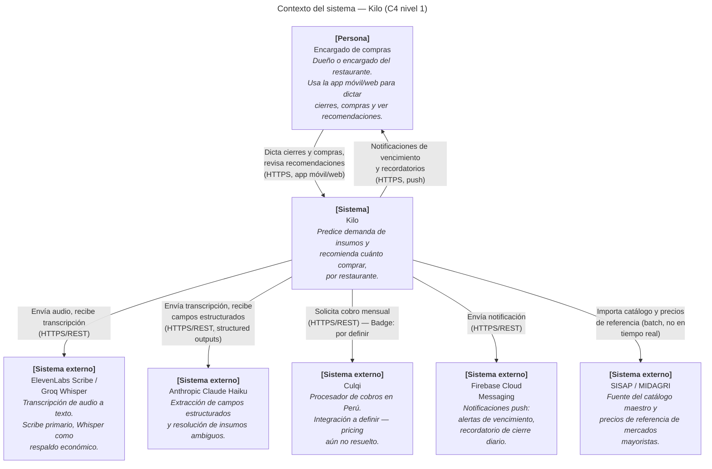

*Estado: diseño — aún no implementado.*

Este es el diagrama de contexto (C4 nivel 1): Kilo como una caja única, quién lo usa y con qué sistemas externos intercambia información. No muestra todavía los contenedores internos — eso está en [Piezas del sistema](/arquitectura/piezas-sistema/).

## Los actores

**Encargado de compras** (persona): el único tipo de usuario real de Kilo, como ya establece [Visión general de producto](/producto/vision-general/). Interactúa con Kilo a través de la app móvil/web — dicta por voz, revisa resúmenes editables, ve recomendaciones de compra y recibe notificaciones.

## Las integraciones externas

- **ElevenLabs Scribe / Groq Whisper** — convierten el audio dictado en texto. Scribe es el proveedor primario por su menor tasa de error; Whisper queda como respaldo económico. Detalle completo en [Pipeline de voz](/arquitectura/pipeline-voz/).
- **Anthropic Claude Haiku** — dos usos distintos: extrae campos estructurados (insumo, cantidad, unidad) de la transcripción, y resuelve insumos ambiguos cuando la búsqueda por similitud de texto no alcanza. Detalle en [Pipeline de voz](/arquitectura/pipeline-voz/#resolución-de-insumos).
- **Culqi** — procesador de cobros peruano, para la suscripción mensual una vez termine el piloto gratuito. La integración concreta (webhooks, flujo de cobro) todavía no está diseñada porque el modelo de pricing en sí sigue sin cerrar — se mantiene liviano en esta página a propósito.
- **Firebase Cloud Messaging** — canal de notificaciones push: alertas de vencimiento de lote (Fase 4) y recordatorios de cierre diario si el encargado de compras no ha dictado a cierta hora.
- **SISAP / MIDAGRI** — la misma fuente que Producto ya eligió para el catálogo de insumos y nombres comerciales reales (ver [Fase 1](/producto/flujo/fase-1-configuracion-inicial/)). Esta página de Arquitectura solo confirma que es una importación batch hacia el catálogo maestro de Kilo, no una consulta en tiempo real durante el uso normal de la app.
