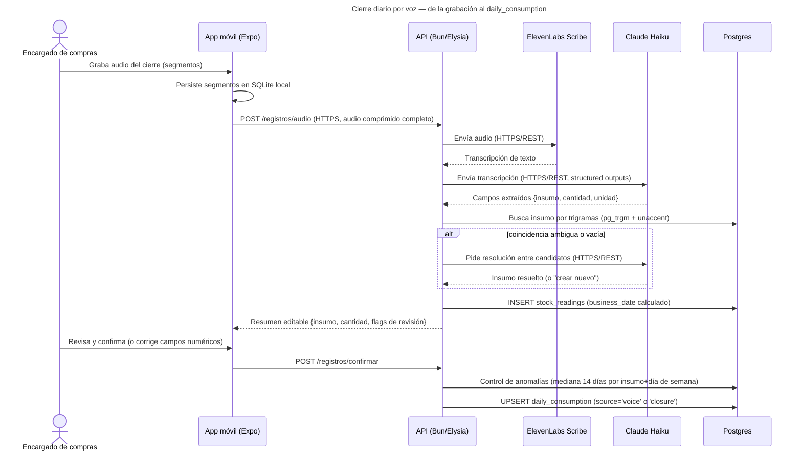
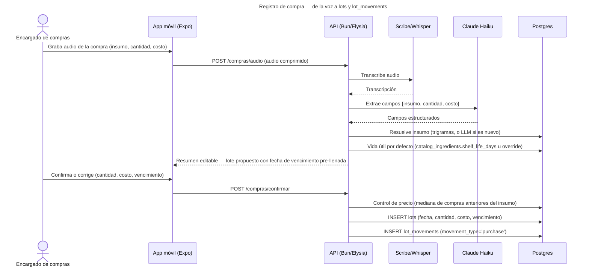

*Estado: diseño — aún no implementado.*

Producto ya cuenta la historia de las 5 fases del ciclo desde la perspectiva del dueño del restaurante (ver [Flujo operativo](/producto/flujo/)). Esta página no repite esa narrativa — agrega la capa técnica debajo: qué mensaje concreto viaja entre qué contenedor, en tres escenarios.

## 1. Cierre diario por voz (Fase 2), de punta a punta



## 2. Batch nocturno — de cron a `forecasts`

```mermaid
---
title: Batch nocturno — recompute de predicciones, un restaurante a la vez
---
sequenceDiagram
    participant Cron as Disparador (cron in-process o endpoint externo)
    participant API as API/Job nocturno (mismo binario Bun)
    participant DB as Postgres

    Cron->>API: POST /internal/jobs/recompute (header de secreto compartido)
    API->>DB: INSERT job_runs (fecha, restricción única) — no-op si ya corrió hoy
    loop por cada restaurante activo
        API->>DB: SELECT historial de daily_consumption del restaurante
        alt insumo intermitente (ADI ≥ ~9-10 días)
            API->>API: Fallback — promedio de 4 semanas por día de semana
        else insumo con historial suficiente
            API->>API: Ajuste Holt-Winters (nivel, estacionalidad; tendencia β=0)
        end
        API->>DB: UPSERT forecasts (origin_date, target_date, método, error estimado)
        Note over API: Un error en un insumo/restaurante no detiene<br/>el resto — try/catch por serie, fallback a<br/>última predicción buena conocida
    end
    API->>DB: UPDATE job_runs (marca corrida completa)
```

## 3. Registro de compra (Fase 5) — de la voz al lote


