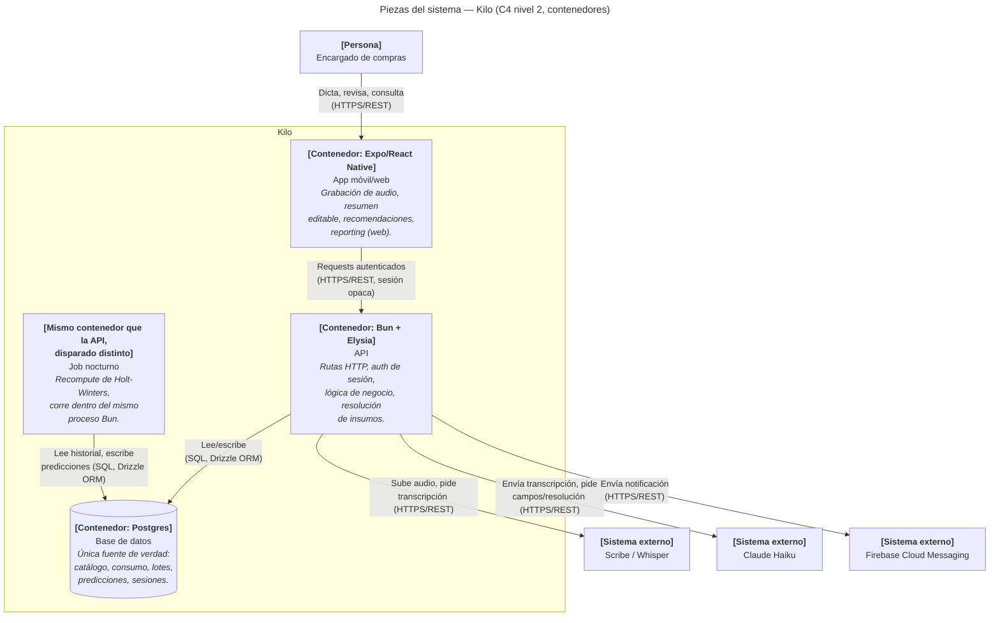

*Estado: diseño — aún no implementado.*

Este es el diagrama de contenedores (C4 nivel 2): abre la caja única de [Contexto del sistema](/arquitectura/contexto-sistema/) y muestra las piezas desplegables por separado dentro de Kilo.

## Los contenedores

**App móvil/web (Expo).** Todo el código de cliente en una sola base con Expo/React Native Web — Android, iOS y Web desde el mismo código, como ya establece [Visión general de producto](/producto/vision-general/). Responsabilidades: grabar audio en segmentos, persistir borradores localmente, mostrar el resumen editable antes de guardar, y mostrar recomendaciones de compra y alertas. El target Web en v1 es de solo lectura/reporting — la grabación de voz queda mobile-only (ver [ADR 0009](/arquitectura/decisiones/0009-app-multiplataforma-con-expo/)).

**API (Bun + Elysia).** El único punto de entrada a la lógica de negocio. Autentica con sesiones opacas, valida con TypeBox, y expone las rutas de catálogo, registro diario, compras, predicciones y recomendaciones. Habla con Postgres vía Drizzle ORM, y con los servicios externos de voz (Scribe/Whisper, Claude Haiku) para procesar cada dictado. Ver [Estrategia técnica](/arquitectura/estrategia-tecnica/) para las convenciones internas.

**Job nocturno.** No es un servicio separado — es el mismo binario/contenedor de la API, disparado por un mecanismo distinto (un endpoint interno protegido, ver [Despliegue](/arquitectura/despliegue/)) en vez de por un request HTTP normal de un cliente. Comparte el mismo código de acceso a datos que el API. Corre el ajuste de Holt-Winters por restaurante y escribe la tabla de predicciones — ver [Motor de predicción](/arquitectura/motor-prediccion/).

**Base de datos (Postgres).** Única fuente de verdad para todo: catálogo, configuración por restaurante, registro diario, lotes de compra, predicciones y sesiones. Sin base analítica separada, sin cola de mensajes — el razonamiento completo está en [Estrategia técnica](/arquitectura/estrategia-tecnica/#por-qué-postgres-solo-sin-cola-de-mensajes-ni-base-analítica-separada) y el esquema completo en [Modelo de datos](/arquitectura/modelo-datos/).

## Servicios externos (ya cubiertos en Contexto del sistema)

Scribe/Whisper, Claude Haiku y Firebase Cloud Messaging se describen con su propósito completo en [Contexto del sistema](/arquitectura/contexto-sistema/); acá solo se muestra qué contenedor interno habla con cada uno.
