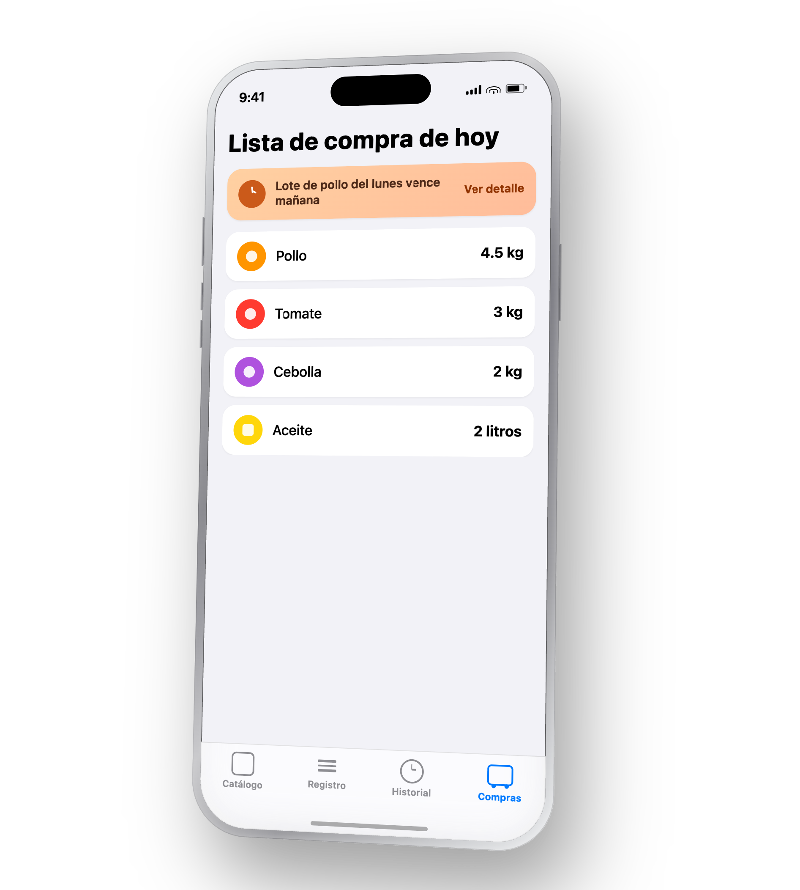

import { Badge } from '@astrojs/starlight/components';

Antes de la siguiente visita programada al mercado (usando el **intervalo de compra**, declarado por categoría en la [Fase 1](/producto/flujo/fase-1-configuracion-inicial/)), Kilo calcula, por insumo:

```text title="Cantidad a comprar, por insumo"
cantidad a comprar = demanda predicha + umbral mínimo − stock actual
```

- **Demanda predicha**: la proyección de Holt-Winters para los días que faltan hasta la próxima compra de esa categoría (el intervalo de compra se declara por categoría, no como un solo número global — ver [Fase 1](/producto/flujo/fase-1-configuracion-inicial/)).
- **Umbral mínimo**: colchón de seguridad calculado automáticamente como un **porcentaje de la demanda predicha** de ese insumo <Badge text="Por validar en piloto" variant="caution" /> — no lo declara el dueño insumo por insumo, para no repetir la misma fricción manual que ya se evitó en el resto del catálogo (ver [Fase 1](/producto/flujo/fase-1-configuracion-inicial/)).
- **Stock actual**: el último dato de stock remanente registrado.

## Alertas de vencimiento por lote (FIFO)

Cada compra registrada al volver del mercado queda como un **lote** — fecha, cantidad y costo (ver [Fase 5](/producto/flujo/fase-5-registro-compra/)). Internamente, el sistema **asume FIFO** (*first in, first out*: el lote más antiguo se consume primero) para poder decir **cuál lote específico** está en riesgo, no solo que "algo" de ese insumo está por vencer. Todo esto es invisible para el encargado de compras — nunca se le pregunta qué lote está usando en la cocina.

**Ejemplo:**

- Lote A de pollo, comprado el lunes → vence el jueves.
- Lote B de pollo, comprado el jueves → vence el domingo.

Una alerta consciente de lotes dice: *"El lote de pollo del lunes vence mañana"* — en vez de una advertencia genérica a nivel de insumo que no distingue cuál lote es el urgente.


