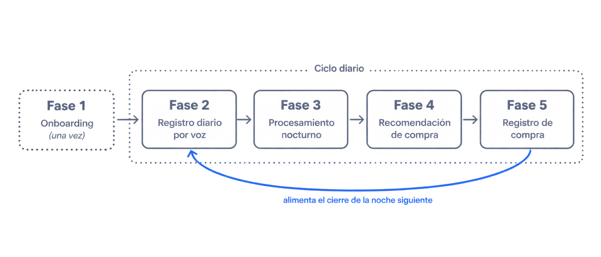

import { CardGrid, Card } from '@astrojs/starlight/components';

Este documento describe el ciclo operativo completo de Kilo, de principio a fin, usando un restaurante ficticio de ejemplo — **"Doña Rosa"**, comida criolla, ubicado en Lima — para ilustrar cada paso con números concretos.

## El ciclo

Es un ciclo y no una lista porque la última fase alimenta a la primera: la compra registrada en la Fase 5 deja el stock del que parte el cierre por voz de la Fase 2 de la noche siguiente. Cada vuelta del ciclo agrega un día real de historial, y ese historial es lo que hace más precisa la predicción de la vuelta siguiente.

## Las 5 fases

<CardGrid>
	<Card title="Fase 1 — Configuración inicial" icon="rocket">
		Una vez, al empezar. Catálogo pre-cargado, unidad de medida, datos declarados y clasificación crítico/secundario de insumos. [Ver el detalle](/producto/flujo/fase-1-configuracion-inicial/).
	</Card>
	<Card title="Fase 2 — Registro diario por voz" icon="comment">
		Cada noche, al cerrar. Cierre diario de stock remanente por voz, control de anomalías y manejo de huecos. [Ver el detalle](/producto/flujo/fase-2-registro-diario/).
	</Card>
	<Card title="Fase 3 — Procesamiento nocturno" icon="moon">
		Automático, de madrugada. Holt-Winters y el sistema de 3 capas de arranque en frío, con ejemplos completos. [Ver el detalle](/producto/flujo/fase-3-prediccion/).
	</Card>
	<Card title="Fase 4 — Recomendación de compra" icon="list-format">
		En la mañana, antes de ir al mercado. Cuánto comprar y alertas de vencimiento por lote (FIFO). [Ver el detalle](/producto/flujo/fase-4-recomendador/).
	</Card>
	<Card title="Fase 5 — Registro de compra" icon="add-document">
		Al volver del mercado. Qué se compró, cuánto y a qué costo; cada compra queda como un lote. [Ver el detalle](/producto/flujo/fase-5-registro-compra/).
	</Card>
</CardGrid>

Empieza por [Fase 1 — Configuración inicial](/producto/flujo/fase-1-configuracion-inicial/).
