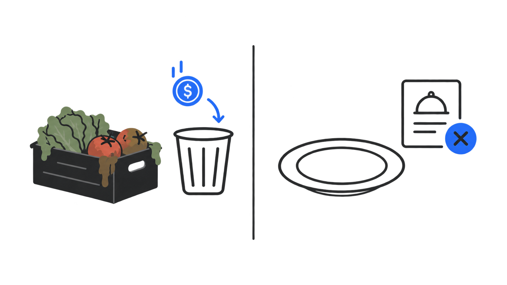

import { LinkCard } from '@astrojs/starlight/components';

## El problema

En Lima, la gran mayoría de dueños de restaurantes pequeños y medianos compran sus insumos **"a ojo"**: sin registro de lo que consumieron antes y sin proyección de lo que van a necesitar, guiándose por intuición y experiencia. Eso falla de dos maneras opuestas, y las dos cuestan dinero:

- **Sobra insumo** → se vence o se desperdicia.
- **Falta insumo** → un plato sale del menú, se pierde la venta y, en el peor caso, el cliente se va insatisfecho y no vuelve.

Ninguna de las dos fallas es visible en el momento en que ocurre: el dueño solo nota el patrón (si lo nota) al final del mes, cuando ya es tarde para corregir esa compra — y para entonces no sabe cuánto perdió, solo que perdió.

## El cliente

Kilo tiene **un solo tipo de cliente real**: el dueño del restaurante. Es quien paga y quien recibe el beneficio directo (menos desperdicio, más ahorro, mejores compras).

Kilo tampoco conecta a dos grupos entre sí — no junta restaurantes con proveedores, por ejemplo. Eso simplifica el producto: no hay que conseguir que los dos lados lleguen al mismo tiempo, ni equilibrar lo que quiere uno contra lo que quiere el otro.

## La solución

Kilo es una **app multiplataforma** (Android, iOS y también Web desde el mismo código base) que:

1. Registra el consumo diario de insumos por voz, sin tener que llenar formularios.
2. Alimenta un **motor de predicción de demanda** (Holt-Winters, un método estadístico de pronóstico — ver [Fase 3 — Procesamiento nocturno](/producto/flujo/fase-3-prediccion/)) que aprende el patrón semanal real de cada restaurante.
3. Genera un **recomendador de compras**: cuánto comprar antes de la siguiente visita al mercado, insumo por insumo.
4. Alerta sobre vencimiento por lote y muestra el ahorro logrado mes a mes.

<LinkCard
	title="Flujo operativo"
	href="/producto/flujo/"
	description="Las 5 fases del ciclo, del catálogo inicial al registro de la compra que cierra el día."
/>
